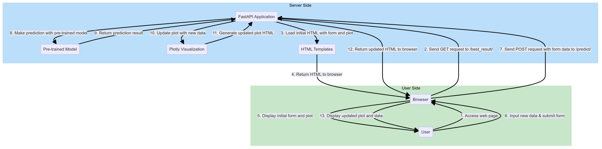
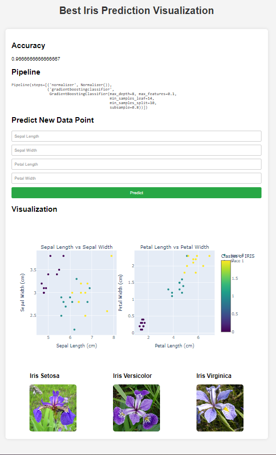
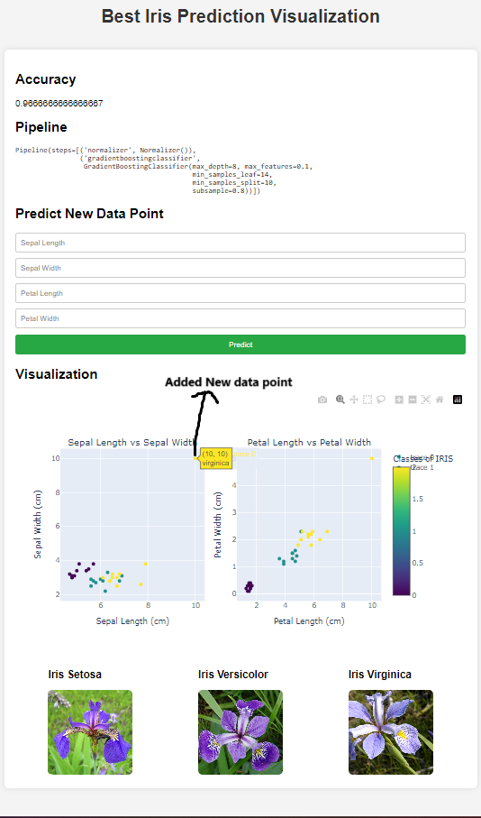

# FastAPI IRIS AutoML Prediction

This project demonstrates how to build a FastAPI application that uses a pre-trained machine learning model to predict the species of the Iris dataset. The application allows users to input new data points and visualize the predictions dynamically.

## Functionality of Application



## Tags


## Features

- Train a machine learning model using AutoML (TPOT) on the Iris dataset.
- Serve predictions and visualizations through a FastAPI application.
- Allow users to input new data points and see the updated predictions on a scatter plot.
- Use Plotly for interactive visualizations.
- Dockerized environment for easy setup and deployment.

## Endpoints

- `/best_result/`: Displays the initial HTML page with a form for inputting new Iris feature values and a plot of the current predictions.
- `/predict/`: Accepts new data points via a form, makes predictions using the pre-trained model, and updates the plot with the new data.

## Requirements

- Docker Desktop
- Docker Compose

## Setup and Run

1. **Clone the Repository**:
    ```bash
    git clone https://github.com/MuzammilMushtaque/FastAPI-Application.git
    cd FastAPI-Application
    ```

2. **Build and Run the Docker Container**:
    ```bash
    docker build -t fastapi-app .
    docker run -d -p 80:80 fastapi-app
    ```

3. **Access the Application**:
    Open your web browser and navigate to `http://localhost:80/best_result/`.

## Project Structure

```
.
├── app
│   ├── __init__.py
│   ├── main.py
│   ├── automl.py
│   └── templates
│       └── visualizations.html
├── Dockerfile
├── requirements.txt
└── README.md
```

- `app/main.py`: Contains the FastAPI application with endpoints for rendering the initial HTML page and handling form submissions.
- `app/automl.py`: Contains the code for training the best pipeline using TPOT and making predictions with the pre-trained model.
- `app/templates/visualizations.html`: HTML template for displaying the form and plot.
- `Dockerfile`: Dockerfile for building the application container.
- `requirements.txt`: List of Python dependencies.

## Detailed Steps

### 1. Train the Model and Generate Visualizations

In `app/automl.py`, we train a machine learning model using TPOT and generate initial visualizations with Plotly.

### 2. Define FastAPI Endpoints

In `app/main.py`, we define the following endpoints:
- `/best_result/`: Loads the initial HTML page with a form for new data input and displays the initial predictions.

- `/predict/`: Accepts new data points via a form, makes predictions using the pre-trained model, and updates the plot with the new data.


### 3. HTML Template

In `app/templates/visualizations.html`, we define the HTML template that includes:
- A form for inputting new Iris feature values.
- A container for displaying the Plotly visualizations.
- Styling for a better user experience.

## Example Usage

1. **Access the Initial Page**: Open `http://localhost:80/best_result/` in your browser. You will see a form to input new Iris feature values and an initial scatter plot of predictions.




2. **Input New Data**: Fill in the form with new Iris feature values and submit. The application will process the data, make predictions using the pre-trained model, and update the scatter plot with the new data point.




## Conclusion

This project provides a simple yet powerful example of how to use FastAPI to build a web application that serves machine learning predictions and interactive visualizations. It demonstrates how to integrate AutoML, FastAPI, Plotly, and Docker for a complete end-to-end solution.

